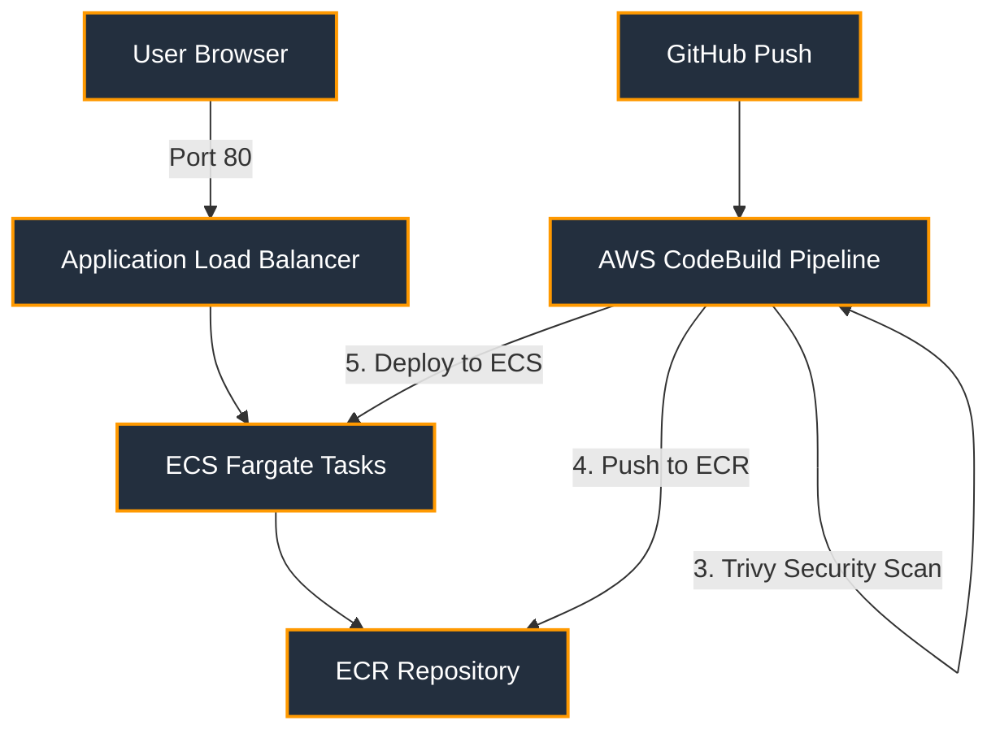

# 🚀 DevOps Java Sprint: Production-Grade CI/CD on AWS ECS Fargate


## 📖 Overview

This repository contains a **fully automated, zero-downtime CI/CD pipeline** for a Java Spring Boot application, deployed on **AWS ECS Fargate**. 

Instead of passive learning, this project was built as a **"One-Day DevOps Sprint"** to demonstrate real-world cloud engineering, security hardening, and infrastructure automation.

---

## 🛠️ Tech Stack

| **Category** | **Technology** |
| :--- | :--- |
| **Language** | Java 11 (Spring Boot 2.7.18) |
| **Containerization** | Docker (Multi-stage builds, Alpine base) |
| **Orchestration** | AWS ECS Fargate (Serverless) |
| **Infrastructure** | Terraform (VPC, ALB, ECR, IAM, Security Groups) |
| **CI/CD** | AWS CodeBuild (Buildspec + GitHub integration) |
| **DevSecOps** | Trivy Container Scanning (Critical vulnerability blocking) |
| **Secret Management** | AWS SSM Parameter Store |

---

## 🧠 Architecture Diagram



---

## 🔑 Key Features & Enterprise Practices

- **✅ Infrastructure as Code (IaC):** AWS resources are fully defined using reusable Terraform modules and `.tfvars` for environment separation (Dev/QA/Prod).
- **✅ Zero-Downtime Deployments:** ECS Rolling Updates ensure new tasks spin up before old ones are drained.
- **✅ DevSecOps Pipeline:** Trivy scans the Docker image for **CRITICAL** CVEs (e.g., Tomcat vulnerabilities) and blocks the deployment if any are found.
- **✅ Security Hardening:** 
  - ALB restricted to specific IP addresses.
  - Security Groups follow the "least privilege" principle (ALB SG vs ECS SG separation).
  - ECR repository set to `MUTABLE` for faster iteration during development.
- **✅ Remote State Management:** Terraform state is stored in an S3 bucket with DynamoDB locking.
- **✅ Observability:** Container logs are streamed to CloudWatch Logs.

---

## 🚀 How to Deploy (Infrastructure)

### Prerequisites
- AWS CLI installed and configured.
- Terraform installed (>= 1.6).
- Docker installed (for local testing).

### Step 1: Clone the Repository
```
git clone https://github.com/Varshita5233/Devops_Projects.git
cd Devops_Projects/devops-java-ecr-project/terraform
```

### Step 2: Initialize & Apply Terraform
```
terraform init
terraform apply -var-file="dev.tfvars" -auto-approve
```

### Step 3: Run the CI/CD Pipeline
- Push a change to the main branch, or manually trigger AWS CodeBuild to:
- Compile the Java code.
- Build the Docker image.
- Scan for vulnerabilities (Trivy).
- Push to ECR.
- Deploy to ECS Fargate.

### Step 4: Access the Application
Get the ALB DNS name from Terraform outputs or the AWS Console:
```
terraform output alb_dns_name
Visit the URL in your browser.
```

### 🧹 Cleanup (Avoid AWS Charges)
```
terraform destroy -auto-approve
```

### 🔒 Security & DevSecOps Highlights
- This project successfully implements real-world security gates:
- CVE Remediation: Discovered and patched CVE-2025-24813 and CVE-2026-41293 in Apache Tomcat by overriding the Tomcat version to 9.0.118.
- Pipeline Blocking: The CI/CD pipeline fails automatically if Trivy detects any CRITICAL vulnerability, preventing vulnerable images from reaching production.
- Network Segmentation: The ECS tasks run in a private network tier, and only the ALB is exposed to the internet.
- Secrets Handling: Environment variables are securely sourced from AWS SSM Parameter Store.

## 🤝 Connect with Me

**Varshita Rajana**  
DevOps Engineer | HashiCorp Certified: Terraform Associate (004)

[](https://linkedin.com/in/varshita2181)
[](https://github.com/Varshita5233)
[](mailto:varshita.rajana2001@gmail.com)

